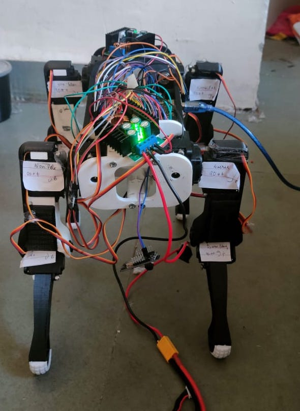

# Advance Quadruped Robot Neo

Neo is a 3D-printed quadruped robot with Full 6-axis body pose manipulation and custom 3DOF Leg Inverse Kinematics Model accounting for offset

## Current Status -:

- [x] *motion* //basic sitting and standing motion completed
- [ ] *Hardware* // custom pcb design to clear the mess
- [ ] *Hardware* // intgerating imu, camera together with rpi
- [x] *Hardware* // Redesign legs to move actuators closer to hip + reinforce all servo mounting.
- [ ] *Simulation* // full autonomous walking
- [ ] *Design* // Research transition between gait & body pose.
- [x] *Simulation* // Gazebo
- [ ] *Hardware* //adding more power servo for smooth motion

  

## 3D Model
In the part_stl you can find all stl file to 3d print

## Neo-viz 
To try the visualization tool out, you'll need to run the [neo_viz.py]

## Documentation
You can find the summary and documentation of the project  on this link -> 

